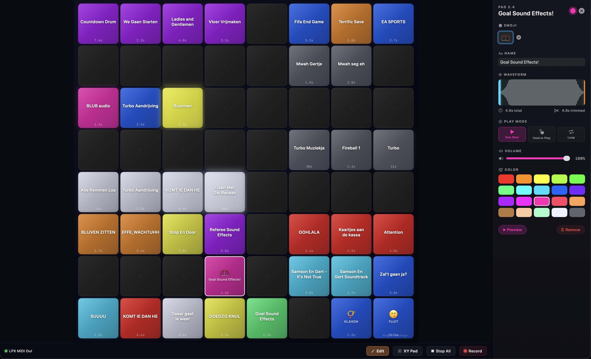

# PadDeck

A live performance tool for **macOS** and **iPad** that transforms your Novation Launchpad into a professional audio deck — trigger samples, process vocals with live effects, and control your show.



## Features

- **8x8 Pad Grid** — drag-and-drop audio files onto 64 pads, rearrange by dragging between pads
- **Live Vocal Pad** — route your microphone through reverb, delay, pitch shift, or distortion effects in real time, with hold or toggle activation modes
- **Multi-Model Launchpad Support** — auto-detects Launchpad X, Mini MK3, Pro MK3, MK2, and Pro; real-time RGB LED sync, velocity-sensitive playback via Force Touch
- **Audio Engine** — low-latency AVAudioEngine playback with per-pad volume, one-shot / loop / hold play modes
- **Waveform Trimming** — visual trim editor with start/end handles and real-time preview
- **Dry/Wet Scene Controls** — adjust vocal effect mix using Launchpad side buttons with a 6-LED bar meter
- **Recording** — record audio from your microphone and assign directly to pads
- **Project Sharing** — export and import `.paddeck` project bundles via AirDrop, Finder, or file picker
- **Project Management** — save, load, and switch between project configurations
- **LED Text Scroller** — scrolls sample names across the Launchpad grid on playback
- **Factory Presets** — 6 built-in synth samples (sine, pad, pluck, sub bass, lead, bell)
- **Multiplatform** — single codebase for macOS 14+ and iPadOS 17+

## Requirements

- macOS 14.0+ or iPadOS 17.0+
- Xcode 16.0+
- [XcodeGen](https://github.com/yonaskolb/XcodeGen)
- Novation Launchpad (optional — the app works without hardware). Supported models: X, Mini MK3, Pro MK3, MK2, Pro

## Build

```bash
# Generate Xcode project
xcodegen generate

# Open in Xcode
open PadDeck.xcodeproj

# Or build from command line
xcodebuild -project PadDeck.xcodeproj -scheme PadDeck -configuration Debug build
```

## Architecture

```
App/            — PadDeckApp entry point, AppState (root coordinator)
Models/         — Value-type structs: Project, PadConfiguration, Sample, GridPosition, etc.
Managers/       — @Observable managers: MIDIManager, AudioEngine, SampleStore, ProjectManager
Views/Grid/     — Main 8x8 grid UI with drag-drop support
Views/PadDetail/— Pad editor: waveform trimmer, color picker, emoji selector
Views/Settings/ — MIDI device, audio, and project management
Views/Recording/— Audio recording dialog
Utilities/      — Launchpad SysEx protocol, MIDI mapping, pixel font, audio formats
```

`AppState` coordinates all managers via closure callbacks. Models are `Codable` and `Sendable` value types. Grid positions map to MIDI notes: `(row + 1) * 10 + (col + 1)` (programmer mode, all supported models). `LaunchpadModel` defines per-model SysEx constants; `MIDIManager` auto-detects the connected model.

## Dependencies

- [DSWaveformImage](https://github.com/dmrschmidt/DSWaveformImage) — waveform rendering for the trim editor
- [ZIPFoundation](https://github.com/weichsel/ZIPFoundation) — project bundle export/import

## License

[MIT](LICENSE)
